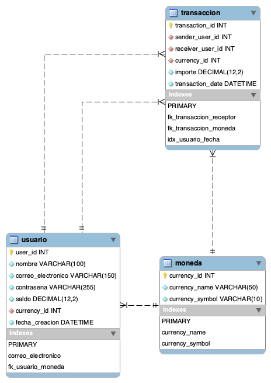

# Alke Wallet — Base de datos relacional

Proyecto de diseño e implementación de una base de datos relacional para una billetera digital. Fue desarrollado con **MySQL 8** y **MySQL Workbench** como parte del módulo de Fundamentos de Bases de Datos Relacionales.

## Objetivo

Modelar la información necesaria para registrar usuarios, monedas y transferencias, manteniendo la integridad de los datos y demostrando operaciones DDL, DML y control transaccional.

## Modelo de datos

La solución contiene tres tablas relacionadas:

- `moneda`: catálogo de monedas disponibles.
- `usuario`: datos de cada usuario, su saldo y moneda asociada.
- `transaccion`: transferencias realizadas entre usuarios.

## Características implementadas

- Claves primarias y foráneas.
- Restricciones `NOT NULL`, `UNIQUE` y `CHECK`.
- Índice compuesto para consultas por usuario y fecha.
- Consultas con `SELECT`, `WHERE`, `INNER JOIN` y `ORDER BY`.
- Operaciones `INSERT`, `UPDATE` y `DELETE`.
- Transacciones mediante `START TRANSACTION`, `COMMIT` y `ROLLBACK`.
- Modelo normalizado para reducir redundancia y mantener consistencia.

## Ejecución

1. Abre MySQL Workbench y conéctate a una instancia de MySQL 8.
2. Abre el archivo [`AlkeWallet.sql`](AlkeWallet.sql).
3. Ejecuta el script completo con el botón del rayo.
4. Revisa los resultados de las consultas en el panel **Result Grid**.

El script crea la base de datos `AlkeWallet`, construye sus tablas, agrega datos ficticios y ejecuta consultas y ejemplos transaccionales.

## Seguridad

Los nombres, correos y credenciales incluidos son únicamente datos ficticios de demostración. En una aplicación real, las contraseñas nunca deben almacenarse en texto plano: el hash debe generarse en el backend con un algoritmo apropiado, como **Argon2id** o **bcrypt**, antes de guardar el valor en la base de datos.

## Autor

**Fabián Oñate**  
Proyecto académico — Desarrollo de Aplicaciones Full Stack JavaScript Trainee
